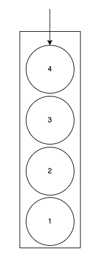
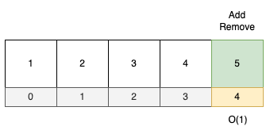
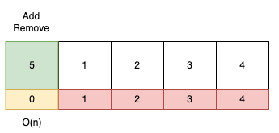
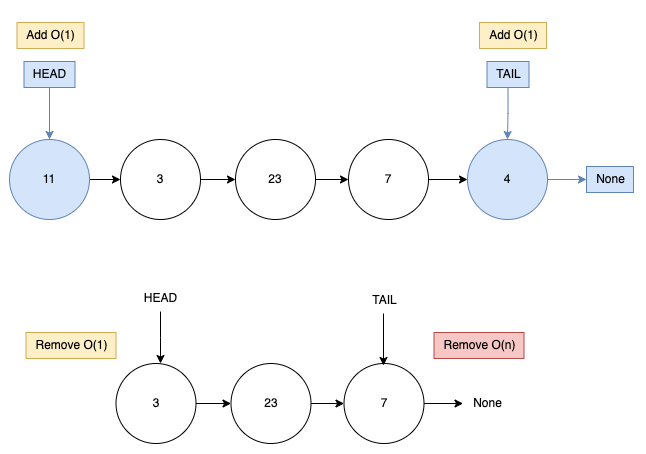
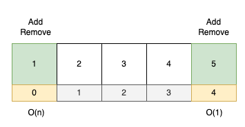
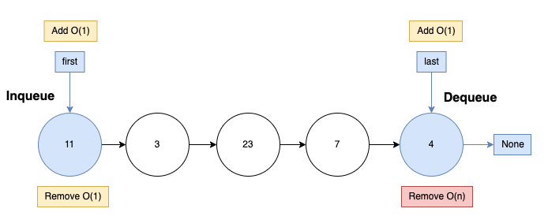

# Stacks

LIFO: Last In First Out
Imagine we have a container with tennis balls, if we add a ball into the container, and we keep adding new balls, now our first ball is not accesible. To access the first element, we need to keep removing the elements above until we get the first element.

## 1. Use a list to implement a stack:

Is very important to define where are we adding or removing elements in the stack

- elements at the botton: Good

- elements at the top: Bad we have to re index each element

If we create the analogy for a linked list

- Remove something at the end of the linked list `O(n)`
- Add something at the end of the linked list `O(1)`
- Remove something at the head of the linked list `O(1)`
- Add something at the head of the linked list `O(1)`
  

For a stack we are going to have Top instead of head and Botton instead of Tail

- For stack we don't need botton

- Push: Is like to add a new element at the top

- Pop: Is different because here we are going to pop first, because the stack have an order and we need to follow

# Queues

When we are in line we have a queue (FIFO)
`inqueue:` Means add something to the pile o queue
`dequeue:` Remove something from the queue

Here you add in one end and you remove in other end. here is an example with a list

But if we use a linked list, we could reduce the complexity

