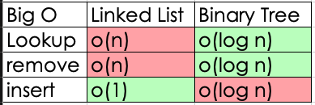

# Trees

We have 3 categories:

- `Full`: Have 2 nodes all nodes
- `Perfect`: All nodes completed
- `Complet`: When we fill from left to right even if is just one node

The binary trees have just one parent for node, if not it is not a binary tree

The children without children are `leafs`

## Binary Search Tree Big O

We use a formula = 2^n - 1 = Number of steps to find a node

Binary Tree is assumed with a complexity of `O(log n)` in the worst scenario it could be O(n) as a linked list if it never forks, but the most common thing is to assume as a O(log n)

